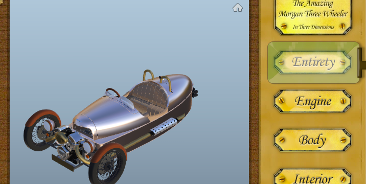

# Steampunk Morgan 3 Wheeler Forge Viewer sample

[](https://nodejs.org/)
[](https://www.npmjs.com/)
[](http://developer-autodesk.github.io/)

[](http://opensource.org/licenses/MIT)


## Description

Please refer to http://through-the-interface.typepad.com/through_the_interface/2014/07/my-first-autodesk-360-viewer-sample.html
for the backroud story fo this sample.


### Thumbnail




## Dependencies

This sample is dependent on the server part on Node.js and couple of Node.js extensions
which would update/install automatically via 'npm':

* Node.js

  Node.js - built on Chrome's JavaScript runtime for easily building fast, scalable network applications.
  You need at least version v5.11.1. You can get Node.js from [here](http://nodejs.org/)<br /><br />
  Node.js modules:
  ```
  "express": "^4.13.4",
  "morgan": "^1.7.0",
  "request": "^2.72.0"
  ```


## Setup Instructions

The sample was created using Node.js and javascript.
There is 3 methods to deploy/configure this project:

### 1. Deploy on Heroku

[](https://heroku.com/deploy)

Once the Heroku server is setup, go on your Heroku Dashboard, select this new server, next Settings, and press the
'Reveal Config Vars.' button.

Create 3 variables like this:

a. PORT = 80

b. CONSUMERKEY = &lt;your consumer key&gt;

c. CONSUMERSECRET = &lt;your consumer secret&gt;

Next restart the server.


### 2. Deploy on your server using environment variables (preferred method)

1. Clone this repo on your server (or local machine),

2. Go in your project directory and execute
   ```
   npm install
   ```
   Define a CONSUMERKEY and CONSUMERSECRET system variables from the console or script which will launch the
   server.<br />
   * Windows<br />
   ```
   set CONSUMERKEY=xxx

   set CONSUMERSECRET=xxx
   ```
   * OSX/Linux<br />
   ```
   export CONSUMERKEY xxx

   export CONSUMERSECRET xxx
   ```
   or passing on the command line to the Node.js process<br />
   ```
   sudo [PORT=<port>] CONSUMERKEY=xxx CONSUMERSECRET=xxx node start.js
   ```
   <br />
   Replace keys placeholder xxx with your own keys.

3. You are done for the setup, launch the node server using the command '[sudo] node start.js'.
   sudo is required only on OSX and Linux.<br />
   * Windows<br />
   ```
   [set PORT=<port>]
   node start.js
   ```
   * OSX/Linux<br />
   ```
   sudo [PORT=<port>] node server.js
   ```
   <br />
   <b>Note:</b> the port argument can be omitted and default to port 5000. If port 80 is already in use by another
   application (like Skype, or IIS, or Apache, ...), you can use any other free port such as 8000, 3000, etc...
   But in the next section you would need to specify the port to use, i.e. http://localhost[:port]/


### 3. Deploy on your server modifying the source code (make sure the files never go public to not compromise your keys)

1. Clone this repo on your server (or local machine),

2. Go in your project directory and edit the api.js file.
   Put your CONSUMERKEY and CONSUMERSECRET keys onto the placeholders line #19 and #20.

3. You are done for the setup, launch the node server using the command '[sudo] node server.js'.
   sudo is required only on OSX and Linux.<br />
   * Windows<br />
   ```
   [set PORT=<port>]
   node server.js
   ```
   * OSX/Linux<br />
   ```
   sudo [PORT=<port>] node server.js
   ```
   <br />
   <b>Note:</b> the port argument can be omitted and default to port 5000. If port 80 is already in use by another
   application (like Skype, or IIS, or Apache, ...), you can use any other free port such as 8000, 3000, etc...
   But in the next section you would need to specify the port to use, i.e. http://localhost[:port]/


--------

## License

This sample is licensed under the terms of the [MIT License](http://opensource.org/licenses/MIT). Please see the [LICENSE](LICENSE) file for full details.


## Written by

Kean Walmsley (Autodesk) <br />
http://through-the-interface.typepad.com/through_the_interface/ <br />
